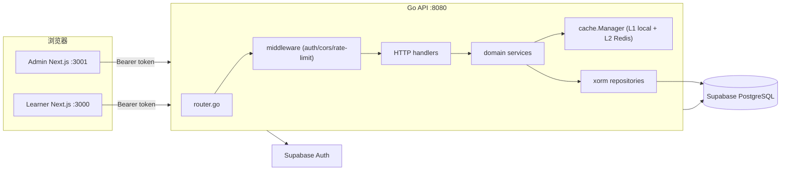
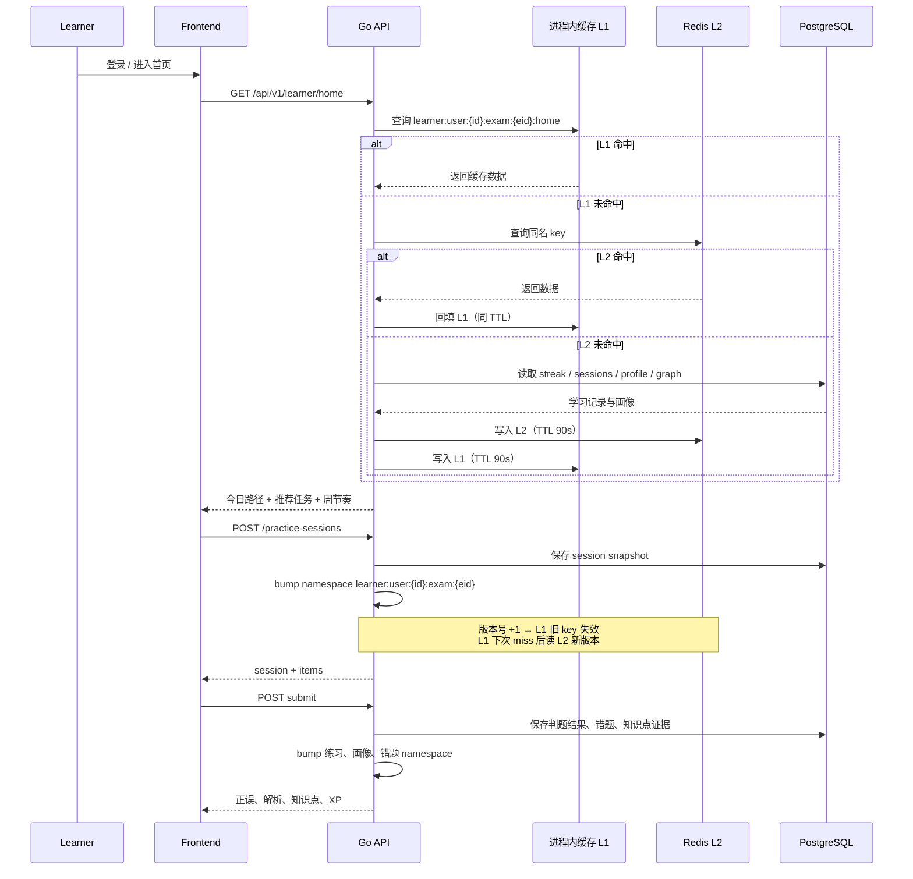
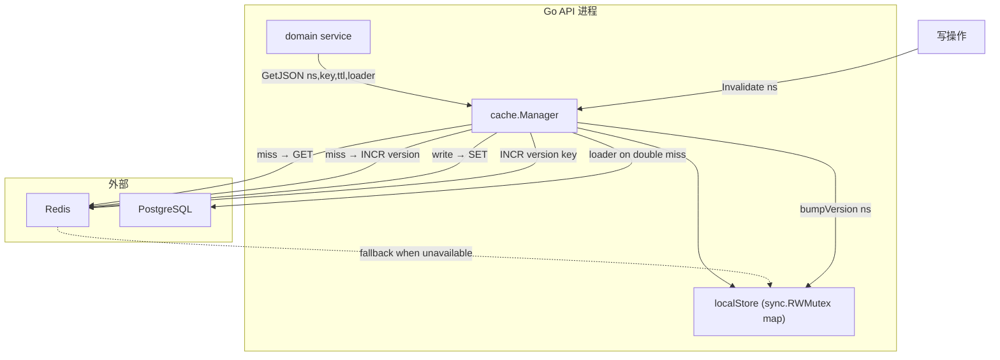

# 系统架构

## 总体结构

当前实现采用三层主链路：

1. Next.js 学习端和管理端负责交互与状态展示。
2. Go API 负责认证、领域编排、业务规则与数据读写。
3. Supabase 提供 Auth 与 PostgreSQL 作为唯一事实源。



## 运行链路

- 登录页从 Supabase 获取 token，前端把 access token 写入 cookie 与 localStorage。
- `backend/internal/http/middleware/auth.go` 校验 `Authorization: Bearer ...`。
- `backend/internal/app/dependencies.go` 将各领域 service 与 repository 组装到路由层。
- 题库、练习、诊断、画像、交互单元都由独立 domain service 编排。

## 关键子系统

- 题库管理：考试 - 科目 - 章节 - 知识点 - 题目 - 版本。
- 练习系统：session 化练习，答题快照写入 `practice_sessions` 与 `practice_session_items`。
- 学习智能化：今日路径、推荐任务、连续学习、周节奏、知识画像。
- 交互式学习单元：步骤驱动、逐步反馈、完成后生成 concept card。
- 平台设置：`admin_settings` 中保存注册开关与 LLM 配置。

## 数据流



### 读取路径（GetJSON）

```
请求 → 检查 L1（Go map + TTL）
         ├─ 命中 → 直接返回
         └─ 未命中 → 检查 L2（Redis GET）
                       ├─ 命中 → 回填 L1 → 返回
                       └─ 未命中 → 执行 loader（SQL 查询）
                                   ├─ 写入 L1 + L2（同一 TTL）
                                   └─ 返回
```

### 失效路径（Invalidate / namespace bump）

```
写操作（提交练习 / 发布内容 / …）
  → service 层调用 cache.Invalidate(ctx, "namespace-a", "namespace-b")
  → 对每个 namespace：
      1. L1：版本号 +1 + 删除匹配前缀的旧 key
      2. L2：Redis INCR 版本号 key + L1 同步版本号
  → 后续 GetJSON 时：
      旧数据 key = prefix:namespace:旧版本:hash → L1 未命中 → L2 未命中 → 触发 loader
      新数据 key = prefix:namespace:新版本:hash → loader 结果写入新 key
```

## 部署视角

- `run.sh` 用于本地开发启动。
- `build.sh` 会把后端二进制、前端源码、Nginx 配置和 `docker-compose.yml` 打包到 `dist/`。
- 生产交付建议以 `dist/docker-compose.yml` 为起点，再接入真实 Supabase 环境变量。

## 缓存与任务

系统实现 L1（进程内）+ L2（Redis）两级缓存，由统一的 `cache.Manager` 管理。

### 两级缓存架构



**L1（进程内）**：`sync.RWMutex` 保护的 `map[string]localEntry`，每条记录带 `expiresAt`。读取时惰性淘汰过期条目。所有 Go 调度器 P 共享同一实例。

**L2（Redis）**：可选。通过 `REDIS_URL` 环境变量配置。未配置时系统仅使用 L1，功能完全正常，只是跨实例无法共享缓存。配置后 L1 在 L2 命中时回填，保证热点数据留在进程内。

**降级**：Redis 连接失败时 `NewManager` 不会 panic，仅 log 警告并回退到纯 L1 模式。运行时 Redis 不可用也不会影响正确性，仅缓存穿透到数据库。

### Key 设计与版本号机制

缓存 key 格式：`{prefix}:cache:data:{namespace}:{version}:{sha1(logicalKey)}`

- **namespace**：业务域划分，如 `content:all`、`auth:token`、`learner:user:{uid}:exam:{eid}`。
- **version**：每个 namespace 独立维护的递增版本号。L1 和 L2 各维护一份。
- **logicalKey**：业务逻辑键（如 `home`、`active-exams`），经 SHA-1 哈希后拼入 key。

**版本号保证一致性**：
- `GetJSON` 时先读当前版本号，拼接 key 查数据。
- `Invalidate` 时 bump 版本号，旧版本 key 永远不会被再次查询到。
- L1 和 L2 版本号同步：L2 的 INCR 返回新版本号后会同步到 L1。

已接入缓存的高频路径包括 token 校验、平台设置、题库树、知识点、题目筛选、知识图谱、学习首页、推荐任务、画像、错题本、交互单元列表 / 详情、练习 session 与 summary。

### 已接入缓存的业务路径

| Namespace | 典型内容 | TTL | 失效触发 |
| --- | --- | --- | --- |
| `auth:token` | Supabase token → Claims（含角色） | 2 分钟 | 角色变更（当前等自然过期） |
| `platform:settings` | 注册开关、LLM 配置 | 5 分钟 | 保存 `admin_settings` |
| `content:all` | 题库树、知识点列表、版本详情、知识图谱 | 2-10 分钟 | 内容发布 / 编辑 / 新建 / 删除 |
| `interactive:all` | 交互单元列表、详情、后台版本列表 | 5-10 分钟 | 交互单元新建 / 编辑 / 发布 |
| `account:stats` | 平台概览统计、管理员用户列表 | 30 秒-2 分钟 | 用户 / 角色 / 考试结构变更 |
| `account:user:{uid}` | 用户档案、活跃报名、管理端用户详情 | 30 秒-2 分钟 | Bootstrap / 报名 / 角色变更 |
| `learner:user:{uid}:exam:{eid}` | 学习首页、画像、推荐、错题本、诊断视图 | 30-120 秒 | 练习提交 / 诊断提交 / 交互完成 |
| `practice:session:{id}` | Session 详情、summary | 30 秒-10 分钟 | 单题提交 / session 创建 |

### 失效与一致性保证

- 写操作完成后，service 层调用 `cache.Invalidate(ctx, namespaces...)`，按需失效一个或多个 namespace。
- 失效不是逐 key 扫描，而是 namespace 版本号递增（bump），旧版本 key 自动失效。
- 单次 `Invalidate` 可传入多个 namespace，适用于一次写操作影响多个缓存域的场景（如练习提交同时影响 session、画像、错题本）。
- 当配置多个 Go 实例时，L2 Redis 保证跨实例版本号一致；L1 各实例独立持有旧数据，但 TTL 到期后会读到新版本。

后台任务仍保持同步实现；后续可把诊断画像重算、今日路径生成、周报生成拆到 worker。

## 安全与访问控制

- 认证：Supabase 签发 token，API 通过 `Authorization: Bearer ...` 校验。
- 授权：Admin / 教研 / Learner 在后端 handler 路由层与前端界面层双重隔离。
- CORS：API 仅对 `API_ALLOWED_ORIGINS` 白名单来源回显 `Access-Control-Allow-Origin`。
- 安全响应头：统一下发 `X-Content-Type-Options`、`X-Frame-Options`、`Referrer-Policy` 等基础头。
- 写接口限流：对 `seed/admin`、内容导入、Admin 写操作、Learner 提交类接口加固定窗口限流，降低误刷与滥用风险。

## CI/CD 与交付

- 根级 `package.json` 提供 `lint` / `test` / `build` / `verify` 命令，作为统一质量门禁。
- `.github/workflows/ci.yml` 在 PR / push 上执行：
  - Backend `go test ./...`
  - Learner/Admin 单元测试
  - Frontend build
  - Playwright 验收脚本 runtime/typecheck
- `workflow_dispatch` 额外提供 `dist/` 打包产物上传，便于面试前生成交付包。

## 监控与运维设计

- 核心接口指标：登录成功率、练习提交成功率、互动步骤提交成功率、首页推荐命中率。
- 性能指标：`/learner/home` 聚合延迟、题库树查询耗时、内容导入耗时、缓存命中率。
- 风险指标：429 次数、401 次数、内容导入失败次数、交互单元评测失败次数。
- 成本指标：数据库读写量、Redis 命中率、AI/API 调用量（若启用 LLM 生成/总结能力）。
