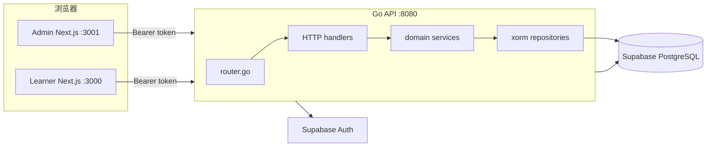
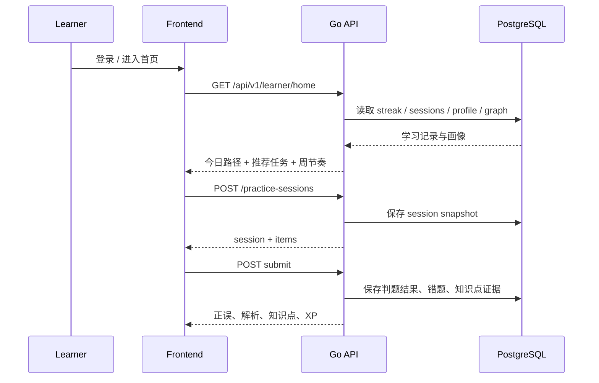

# 系统架构

## 总体结构

当前实现采用三层主链路：

1. Next.js 学习端和管理端负责交互与状态展示。
2. Go API 负责认证、领域编排、业务规则与数据读写。
3. Supabase 提供 Auth 与 PostgreSQL 作为唯一事实源。

## 运行链路

- 登录页从 Supabase 获取 token，前端把 access token 写入 cookie 与 localStorage。
- `backend/internal/http/middleware/auth.go` 校验 `Authorization: Bearer ...`。
- `backend/internal/app/dependencies.go` 将各领域 service 与 repository 组装到路由层。
- 题库、练习、诊断、画像、交互单元都由独立 domain service 编排。

## 关键子系统

- 题库管理：考试 - 科目 - 章节 - 知识点 - 题目 - 版本。
- 练习系统：session 化练习，答题快照写入 `practice_sessions` 与 `practice_session_items`。
- 学习智能化：今日路径、推荐任务、连续学习、周节奏、知识画像。
- 交互式学习单元：步骤驱动、逐步反馈、完成后生成 concept card。
- 平台设置：`admin_settings` 中保存注册开关与 LLM 配置。

## 数据流

## 部署视角

- `run.sh` 用于本地开发启动。
- `build.sh` 会把后端二进制、前端源码、Nginx 配置和 `docker-compose.yml` 打包到 `dist/`。
- 生产交付建议以 `dist/docker-compose.yml` 为起点，再接入真实 Supabase 环境变量。

## 缓存与任务

当前代码已实现二级缓存：

- L1：Go 进程内 TTL 缓存。
- L2：Redis，通过 `REDIS_URL` 配置。
- 失效：按 namespace 维护版本号，写入事件 bump version，旧 key 自动失效。

已接入缓存的高频路径包括 token 校验、平台设置、题库树、知识点、题目筛选、知识图谱、学习首页、推荐任务、画像、错题本、交互单元列表 / 详情、练习 session 与 summary。

### 典型缓存项

| Namespace | 典型内容 | L1/L2 TTL | 失效触发 |
| --- | --- | --- | --- |
| `platform:settings` | 注册开关、LLM 配置 | 5 分钟 | 保存 `admin_settings` |
| `content:all` | 题库树、知识点、版本详情、知识图谱 | 2-10 分钟 | 内容发布、编辑、新建、删除 |
| `learner:user:{user}:exam:{exam}` | 今日首页、画像、推荐、错题本、诊断视图 | 30-120 秒 | 练习提交、诊断提交、交互完成 |
| `interactive:all` | 交互单元列表、详情、后台版本列表 | 5-10 分钟 | 交互单元新建 / 编辑 / 发布 |
| `practice:session:{id}` | session 详情、summary | 30 秒-10 分钟 | 单题提交、session 创建 |
| `account:stats` | 平台概览、用户列表 | 30 秒-2 分钟 | 用户、角色、考试结构变更 |
| `auth:token` | Supabase token claims | 2 分钟 | token 自然过期 / 用户角色变化 |

### 失效方式

- 不是逐 key 扫描，而是 namespace 版本号递增。
- 写操作只需要 bump 对应 namespace，旧 key 会在新版本下失去命中。
- Go 进程内缓存与 Redis 都使用同一 namespace 版本。

后台任务仍保持同步实现；后续可把诊断画像重算、今日路径生成、周报生成拆到 worker。
