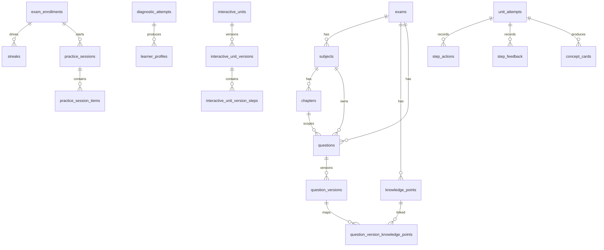

# 数据库设计

后端数据库使用 Supabase PostgreSQL。当前实现以 xorm 模型和原生 SQL 为事实来源，核心设计围绕“内容版本化 + 学习快照 + 可解释画像”。

## 核心关系图

## 账号与平台

| 表 | 作用 | 关键字段 |
| --- | --- | --- |
| `profiles` | 用户资料 | `id`, `display_name`, `avatar_url`, `status` |
| `user_roles` | RBAC | `user_id`, `role`, `granted_by` |
| `exams` | 考试主表 | `code`, `name`, `status`, `next_exam_date` |
| `exam_enrollments` | 学习者报考关系 | `user_id`, `exam_id`, `status`, `started_at`, `passed_at` |
| `wallets` | XP/金币余额 | `user_id`, `coins_balance` |
| `streaks` | 连续学习 | `exam_enrollment_id`, `current_streak`, `best_streak`, `last_study_at` |
| `virtual_pets` | 额外成长层 | `exam_enrollment_id`, `species`, `level`, `xp`, `mood_state` |
| `admin_settings` | 平台设置 | `key`, `value_json`, `updated_at` |

## 题库与知识图谱

| 表 | 作用 | 关键字段 |
| --- | --- | --- |
| `subjects` | 科目 | `exam_id`, `code`, `name`, `sort_order` |
| `chapters` | 章节 | `subject_id`, `code`, `name`, `sort_order` |
| `knowledge_points` | 知识点 | `exam_id`, `code`, `name`, `description`, `status` |
| `knowledge_point_edges` | 知识点前置 / 关联关系 | `from_knowledge_point_id`, `to_knowledge_point_id`, `edge_type`, `weight` |
| `questions` | 题目主表 | `exam_id`, `subject_id`, `chapter_id`, `status`, `current_published_version_id` |
| `question_versions` | 题目版本 | `question_id`, `version_no`, `status`, `question_type`, `difficulty`, `stem`, `options`, `correct_answer`, `explanation` |
| `question_version_knowledge_points` | 题目 - 知识点映射 | `question_version_id`, `knowledge_point_id` |

### 版本化策略

- `questions` 代表题目实体。
- `question_versions` 保存可发布版本。
- 发布后通过 `current_published_version_id` 指向最新正式版。
- 已发布版本只读，编辑会克隆出新 draft。

## 学习闭环

| 表 | 作用 | 关键字段 |
| --- | --- | --- |
| `practice_sessions` | 练习会话快照 | `user_id`, `exam_id`, `scope`, `status`, `total_count`, `answered_count`, `correct_count`, `xp_earned`, `coins_earned` |
| `practice_session_items` | 会话题目快照 | `session_id`, `question_id`, `question_version_id`, `subject_id`, `chapter_id`, `question_type`, `position`, `stem`, `options`, `correct_labels`, `explanation`, `knowledge_point_ids`, `user_answer`, `is_correct` |
| `diagnostic_attempts` | 诊断记录 | `user_id`, `exam_id`, `trigger_type`, `status`, `summary` |
| `learner_profiles` | 画像快照 | `user_id`, `exam_id`, `profile_version`, `profile_summary`, `confidence_score`, `source_snapshot` |

### 诊断与画像

- `diagnostic_attempts.summary` 保存诊断题目与结果快照。
- `learner_profiles.profile_summary` 保存推荐科目、章节、知识点与可解释原因。
- `profile_version` 便于重算历史画像，不覆盖旧记录。

## 交互单元

| 表 | 作用 | 关键字段 |
| --- | --- | --- |
| `interactive_units` | 交互单元主表 | `exam_id`, `subject_id`, `title`, `status`, `current_published_version_id` |
| `interactive_unit_versions` | 交互单元版本 | `interactive_unit_id`, `version_no`, `status`, `metadata`, `published_at`, `published_by` |
| `interactive_unit_version_steps` | 步骤定义 | `unit_version_id`, `step_no`, `widget_type`, `content`, `initial_state`, `allowed_actions`, `evaluation_config`, `feedback_map`, `hint_policy`, `knowledge_point_ids`, `knowledge_point_tags` |
| `unit_attempts` | 学习尝试 | `user_id`, `unit_version_id`, `status`, `completed_at` |
| `step_actions` | 步骤动作日志 | `attempt_id`, `step_id`, `action_payload` |
| `step_feedback` | 步骤反馈 | `attempt_id`, `step_id`, `is_correct`, `allow_continue`, `hint` |
| `concept_cards` | 完成后总结卡片 | `attempt_id`, `unit_version_id`, `content` |

## 索引建议

当前代码已经依赖主键、唯一约束和外键；为了支撑高频查询，建议补充这些复合索引：

- `subjects(exam_id, sort_order)`
- `chapters(subject_id, sort_order)`
- `knowledge_points(exam_id, status, name)`
- `questions(exam_id, subject_id, chapter_id, status)`
- `question_versions(question_id, version_no desc)`
- `question_version_knowledge_points(question_version_id, knowledge_point_id)`
- `exam_enrollments(user_id, exam_id, created_at desc)`
- `practice_sessions(user_id, exam_id, created_at desc)`
- `practice_session_items(session_id, position)`
- `diagnostic_attempts(user_id, exam_id, created_at desc)`
- `learner_profiles(user_id, exam_id, profile_version desc)`
- `interactive_units(exam_id, subject_id, status)`
- `interactive_unit_versions(interactive_unit_id, version_no desc)`
- `interactive_unit_version_steps(unit_version_id, step_no)`
- `unit_attempts(user_id, unit_version_id, created_at desc)`

## 一致性

- 练习 session 与题目快照在一个事务里写入，保证刷新 / 重试不改变题目版本。
- 题目发布时只切换指针，不改旧版本内容。
- 诊断和画像采用追加写，避免覆盖历史证据。
- 交互单元完成后才生成 concept card，避免半途状态污染结果。

## 现状说明

数据库访问以 Go + xorm + 原生 SQL 为主，所有学习数据都落在 PostgreSQL 中。当前代码没有单独的 Redis 数据表或缓存表，缓存属于可扩展层，不是主存储。

