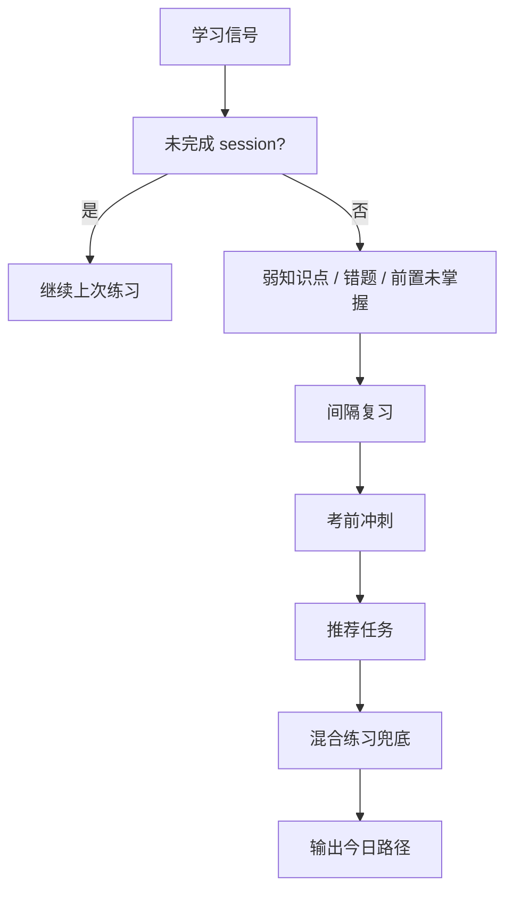
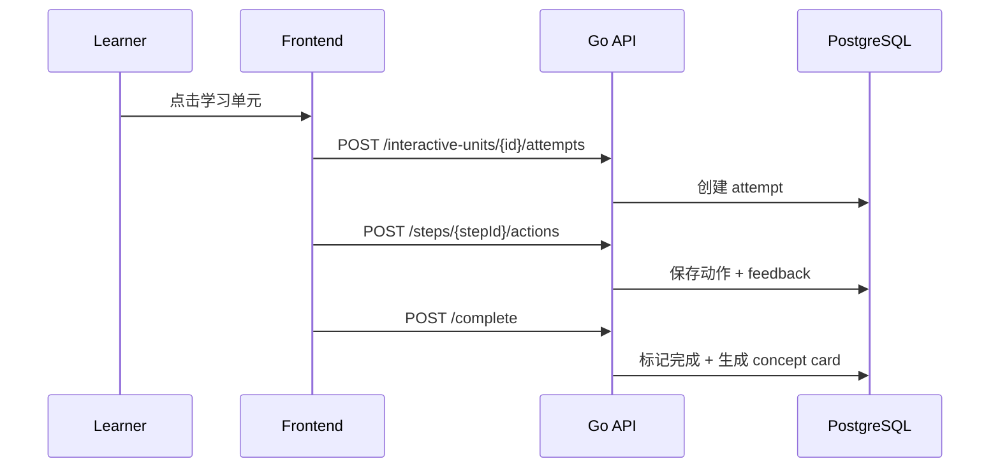

# 学习智能化设计

这部分覆盖三个进阶能力：今日学习路径、诊断画像 / 任务选择、交互式学习单元。

## 统一信号

系统会综合这些输入：

- 最近诊断结果
- 最近练习会话
- 错题本与错误次数
- 知识点前置关系
- 连续学习与最近 7 天节奏
- 交互单元步骤反馈与 concept card

## 今日学习路径

当前实现会在首页生成 2-4 个任务，优先级大致是：

1. 继续未完成练习
2. 间隔复习薄弱知识点
3. 考前冲刺任务
4. 推荐任务中的非重复项
5. 混合练习兜底

### 完成状态

- 已完成练习通过当天完成数回写到今日任务状态。
- 已完成交互单元通过当日已完成次数回写到对应任务。
- 状态字段包含 `pending / in_progress / completed`，并显示进度百分比。

## 诊断画像

诊断的目标不是单纯对错，而是产出可执行的下一步学习建议。

输出内容包括：

- 推荐难度
- 推荐科目 / 章节 / 知识点
- 每个推荐项的证据说明
- 知识点掌握度与置信度

### 解释性字段

`home.RecommendationReason`、`diagnostic.ProfileSummary`、`home.WeakPoint` 这几层都保留了可解释字段：

- `reason_code`
- `reason_text`
- `evidence`
- `review_stage`
- `forgetting_due_at`
- `source`

## 任务选择规则

任务选择遵循“先补短板，再保连续，再推进新内容”的顺序。

- 新学：用于有空白知识点或诊断尚未覆盖的区域。
- 补前置：根据 `knowledge_point_edges` 找前置依赖。
- 错题复习：根据 `practice_session_items.is_correct = false` 与错题本统计。
- 间隔复习：根据遗忘到期时间与复习阶段。
- 章节推进：在低风险情况下扩展内容覆盖。

## 连续学习

连续学习依赖 `streaks` 与当天完成事件。设计目标是：

- 幂等
- 可恢复
- 可解释

因此“是否完成今日任务”不依赖前端临时状态，而是由后端根据当日 session / interactive attempt 记录计算。

## 错题本

错题本按题目、知识点、章节和状态聚合。

- 选择题的 options 会在 session snapshot 中保存，保证后续查看不丢失。
- 每条错题记录包含错误次数、修正次数、首次与最近出错时间。
- 复习页面可按考试 / 科目 / 章节 / 知识点过滤。

## 交互式学习单元

交互单元采用“步骤定义 + 即时反馈 + 完成总结”模型。

步骤 schema 包括：

- `widget_type`
- `content`
- `initial_state`
- `allowed_actions`
- `evaluation_config`
- `feedback_map`
- `hint_policy`
- `knowledge_point_ids`

### 运行流程

1. 学习者打开单元详情。
2. 创建 `unit_attempts` 记录。
3. 每次步骤动作写入 `step_actions`。
4. 评测器返回即时反馈并写入 `step_feedback`。
5. 完成后生成 `concept_cards`。

## 缓存与任务化

当前代码已经把学习首页、画像、错题本、题库与交互单元接入 Go 本地缓存 + Redis 二级缓存。学习事件、诊断提交、练习提交、交互单元完成和内容发布会 bump 对应 namespace，让今日路径和画像尽快刷新。

后台任务目前仍是同步计算。若后续接入 worker，优先拆这几类：

- 今日首页聚合
- 画像重算
- 学习路径生成
- 交互单元概念卡生成
- 周报 / 学习报告

这样能把“读取快”与“计算重”分开。
